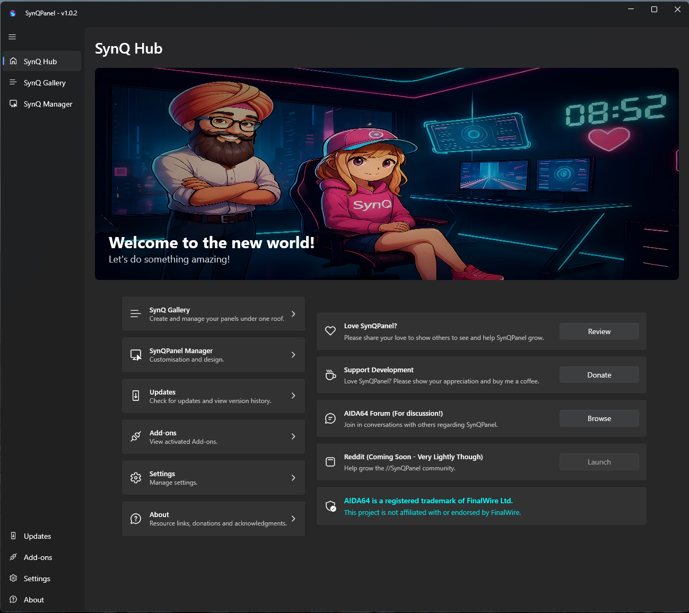
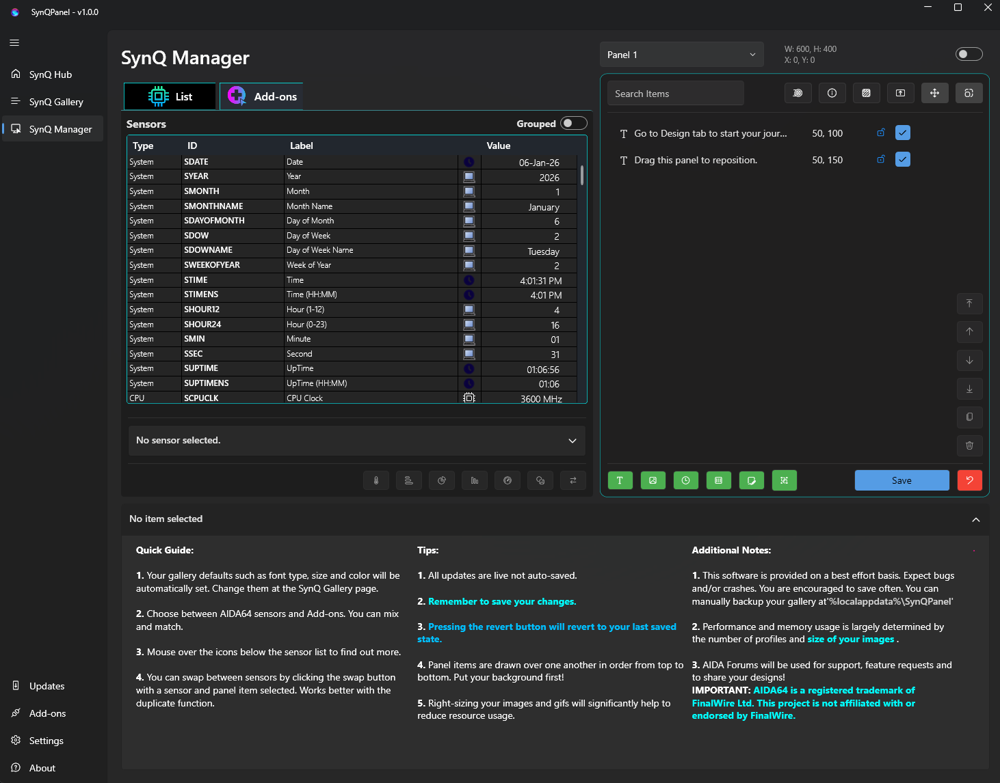
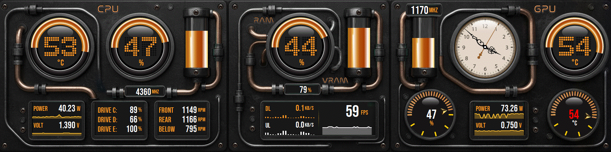

<div align="center">
  
  
  <h1>SynQPanel</h1>
  <p><strong>Panel-Based Visualization for AIDA64</strong></p>
  
  <!-- Badges -->
  <p>
    
    
    
    
    
    
  </p>

  <p>
    <strong>A desktop panel visualization application for Windows, designed to display hardware telemetry and system information in clean, customizable visual layouts using AIDA shared memory.</strong>
  </p>

  <p>
    <a href="#-screenshots">Screenshots</a> •
    <a href="#-features">Features</a> •
    <a href="#-installation">Installation</a> •
    <a href="#-quick-start">Quick Start</a> •
    <a href="#-documentation">Documentation</a>
  </p>
</div>

---

## 📸 Screenshots

<p align="center">
  
  
</p>

<p align="center">
  
</p>

<p align="center"><em>Custom panels showing CPU, GPU, and system metrics using AIDA Shared Memory.</em></p>

---

## 📖 About This Project

**SynQPanel is a hard fork of [InfoPanel](https://github.com/habibrehmansg/infopanel) by Habib Rehman**, developed independently for AIDA64 users.

It focuses on **panel-based presentation**, allowing users to design compact, information-dense displays for desktops or secondary screens. Built with WPF using MVVM architecture, SynQPanel is designed to be **minimal, precise, and visually intentional**, prioritizing clarity over excess.

### 🔄 What Changed from InfoPanel

**✅ Added:**
- AIDA64 Shared Memory support
- Native AIDA64 sensorpanel handling
- FlipClock animation
- Enhanced Add-ons

**❌ Removed:**
- HWInfo and LibreHardwareMonitor support
- USB device support (beadapanel, Turing, etc.)

SynQPanel maintains the original GPL 3 license and includes significant modifications for AIDA64-focused workflows.

---

## ✨ Features

<table>
<tr>
<td width="50%">

### 🎨 **Customizable Panels**
- Fully customizable layouts
- Precise positioning control
- Multiple visualization elements
- Profile-based configurations

</td>
<td width="50%">

### 📊 **Rich Visualizations**
- Text displays
- Gauges and meters
- Progress bars
- Tables and grids

</td>
</tr>
<tr>
<td width="50%">

### 🔧 **AIDA64 Integration**
- Direct shared memory access
- Real-time sensor data
- Native sensorpanel support
- No USB configuration needed

</td>
<td width="50%">

### 🖥️ **Display Flexibility**
- Multi-monitor support
- Resolution-adaptive layouts
- Portrait/landscape orientations
- Secondary display optimization

</td>
</tr>
</table>

### 🎯 Key Capabilities

- **Panel-based system visualization** - Create information-dense dashboards
- **Custom layouts with precise positioning** - Pixel-perfect control
- **Multiple visualization elements** - Text, gauges, bars, tables, and more
- **Profile-based configurations** - Switch between different layouts easily
- **Built-in add-ons** - Runtime and system context information
- **Extensible architecture** - Controlled add-on system for stability

---

## 💾 Installation

### Prerequisites

- **Windows 10 / 11**
- **AIDA64** with Shared Memory enabled 

### Download & Install

1. **Download the latest release:**
   - Go to [Releases](https://github.com/sursingh-hub/SynQPanel/releases/latest)
   - Download the latest version exe file

2. **Extract and run:**
   - Run `SynQPanel.exe`

3. **Configure AIDA64:**
   - Open AIDA64 → Preferences → External Applications
   - Enable "Shared Memory"
   - Click OK

---

## 🚀 Quick Start

### 1. Launch SynQPanel
Run `SynQPanel.exe` after ensuring AIDA64 is running with Shared Memory enabled.

### 2. Create Your First Panel
- Click **"New Panel"** or import an existing profile
- Navigate to SynQ Manager
- Add elements (text, gauges, bars) from the toolbar
- Bind elements to AIDA64 sensors
- Position and style elements to your preference

### 3. Save Your Layout
- Save as a profile for easy switching
- Export/import profiles to share with others

### 4. Optimize for Your Display
- Adjust panel size and position
- Configure for multi-monitor setups
- Test different orientations

---

## 📚 Documentation

### Panel Configuration
Panels are fully customizable and can be tailored to show only the information you care about. Layouts can be adapted for different resolutions, orientations, and display use cases.

### Data Source
SynQPanel retrieves hardware telemetry via **AIDA64 Shared Memory**. A compatible AIDA64 installation with Shared Memory enabled is required to access sensor data.

### Add-ons
SynQPanel includes a small set of built-in add-ons that demonstrate runtime, system, and session information. The add-on architecture is intentionally minimal, focused on stability and long-term maintainability.

### Community Resources
- **Forum Discussion:** [AIDA64 Forums Thread](https://forums.aida64.com/topic/22019-introducing-synqpanel/)
- **Panel Designs:** Share and download community-created panels [AIDA64 Thread: Share your Sensorpanels](https://forums.aida64.com/topic/13296-share-your-sensorpanels/)
- **Tips & Tricks:** (coming soon)

---

## 🤝 Contributing

We welcome contributions! Whether it's bug reports, feature requests, or code contributions:

1. **Report Issues:** Use the [Issues](https://github.com/sursingh-hub/SynQPanel/issues) tab
2. **Suggest Features:** Open a feature request discussion
3. **Submit Pull Requests:** Fork, modify, and submit PRs
4. **Share Panels:** Post your custom panel designs in discussions [AIDA64 Forums Thread](https://forums.aida64.com/topic/22019-introducing-synqpanel/)

---

## ⚠️ Status

SynQPanel is currently in **beta**.  
Features, add-ons, and internal APIs may evolve as development continues.

---

## 📜 Copyright & Attribution

**Original project:** InfoPanel © 2024 Habib Rehman  
**This fork:** SynQPanel © 2025 SynQPanel contributors

SynQPanel is derived from the [InfoPanel](https://github.com/habibrehmansg/infopanel) 
codebase and has since been independently modified and maintained with a different feature direction focused on AIDA64 integration.

Both projects are licensed under **GNU GPL v3.0**.

---

## 📄 License & Disclaimer

SynQPanel is free software licensed under the **GNU General Public License v3.0 or later**.

You are free to use, modify, and redistribute this software under the terms of the GPL.  
See the [LICENSE](LICENSE) file for full details.

**Trademark Notice:**  
AIDA64 is a registered trademark of FinalWire Ltd.  
SynQPanel is an independent project and is **not affiliated with or endorsed by FinalWire Ltd.**

---

<div align="center">
  <p>Made with ❤️ for the AIDA64 community</p>
  <p>
    <a href="https://github.com/sursingh-hub/SynQPanel/releases">Download</a> •
    <a href="https://github.com/sursingh-hub/SynQPanel/issues">Report Bug</a> •
    <a href="https://forums.aida64.com/topic/22019-introducing-synqpanel/">Forum Discussion</a>
  </p>
</div>
```

---

